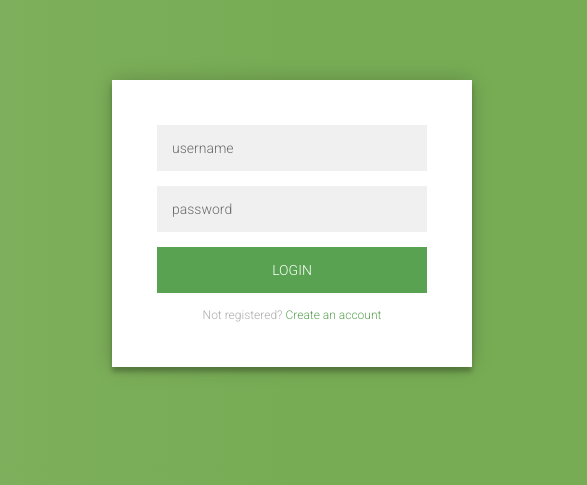
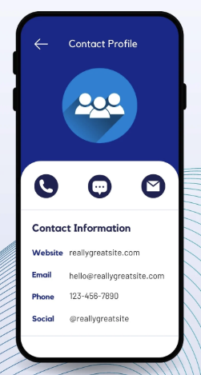

# Gestor de tareas

A lo largo de la materia vamos a ir realizando una aplicación de gestion de tareas.

Esta primera versión solo tendrá HTML.

Crear un `index.html` donde mostraran:
  * un titulo
  * una imagen
  * un formulario con 1 input (con su etiqueta) y 1 boton
  * una lista de tareas donde cada elemento de la lista tiene:
    * Un texto
    * Un boton de completar
   
Este es otro cambio para ver como sincronizar una pull request. 

## Tarea 2

Agregar CSS a la página creada la clase anterior, para que se vea similar a la imagen.
Se puede ser creativo en el diseño.

### Bonus + practica en casa

Implementar los siguientes diseños utilizando los conceptos vistos en clase, se valorará la correcta utilización de flexbox o grid y el uso de su creatividad para mejorar los diseños.

