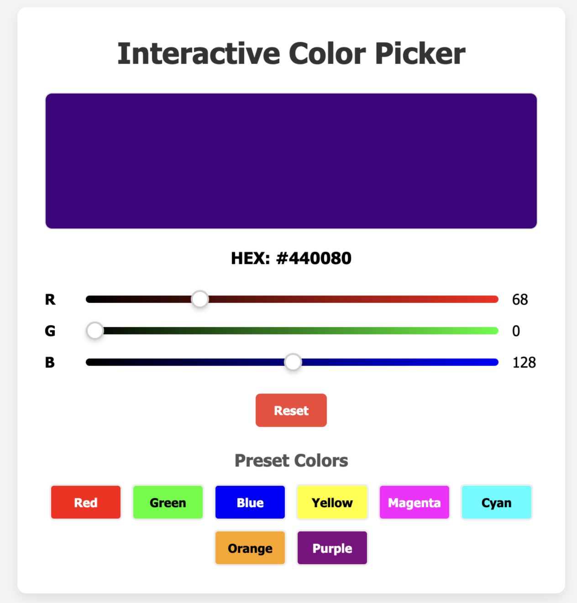

## Tarea 3

Va mejorando nuestra aplicación. Ahora vamos a darle funcionalidad.
Utilizando un script en JS, vamos a hacer que funcione nuestra aplicación.

- Cuando se apriete el botón de add, validar que se haya ingresado texto en el input. Agregar una nueva tarea incompleta con ese texto y borrar el input.
- Realizar lo mismo cuando se apriete la tecla Enter mientras se escribe en el input. (Puntos extra si lo hacen con 1 solo evento los 2).
- Capacidad de completar y descompletar una tarea al clickear en su correspondiente checkbox.
- Capacidad de eliminar una tarea de la lista.
- Eliminar todas las tareas ya completadas al clickear el botón de Clear Completed.
- Agregar botones de filtro que permitan ver todas las tareas, las incompletas y las completas. Prestar atención que si se aplica un filtro, no se pierdan datos y se pueda volver a un estado anterior.

### Tarea en clase

Vamos a armar un "Selector de Colores Interactivo"—una app chiquita donde los usuarios puedan mezclar deslizadores RGB (Rojo, Verde, Azul) para cambiar el color de fondo dinámicamente. Esto se enfoca puramente en manipulación del DOM, event listeners y actualizaciones en tiempo real, sin usar fetch/promises.

Ejercicio: Mezclador de Colores RGB

Características:

- Tres deslizadores (R, G, B) para controlar los valores de color (0-255).
- Visualización en tiempo real del color mezclado.
- Muestra el código HEX del color actual.
- Botón de reset para volver al color default.
- Colores predefinidos (rojo, violeta, naranja, etc.)

